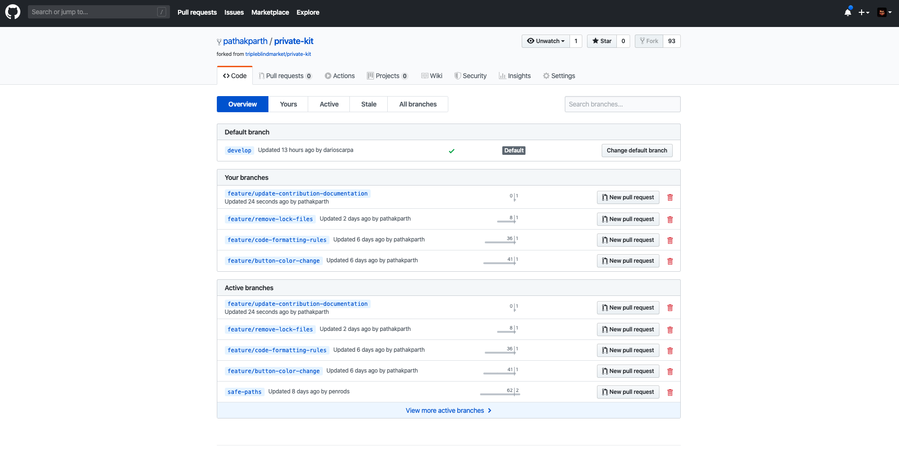
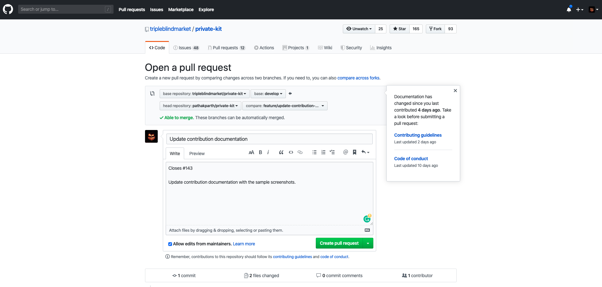

# How to contribute

---

**NOTE**

As of 3-May-2020 the COVID Safe Paths repo has moved to a new location (https://github.com/Path-Check/covid-safe-paths). If you've already set the `upstream` in your repo, GitHub's redirects will make it so things still work; However for consistency we highly recommend you change your `upstream` to point to the new repo location e.g.

```
git remote add upstream git@github.com:Path-Check/covid-safe-paths.git
```

---

We welcome participation in an open project. We want to make it as easy as possible for people to work together, so please follow these guidelines to prepare and submit a pull request.

- Filtering by [good first issues](https://github.com/Path-Check/covid-safe-paths/labels/good%20first%20issue) is the recommended way to begin contributing to the project
- Localization/Language updates are handled in [Lokalise](https://lokalise.com/). More info on how to contribute [here](https://github.com/Path-Check/covid-safe-paths/wiki/Localization-Contributing-Guidelines)

## Create A New Issue

- You need a Github account. You can [create one](https://github.com/signup/free) for free.

- Submit an [Issue](https://github.com/Path-Check/covid-safe-paths/issues) against the repo to describe the idea or problem if there is not one yet.

- Describe a bug by including steps to reproduce, and the earliest version you know is affected.

- Describe a new feature with as much detail as possible.

- Fork the repository on GitHub:

- Visit https://github.com/Path-Check/covid-safe-paths
- Click on the "Fork" button in the upper-left corner.

- Clone the forked repository to your local machine:

```bash

cd ~ # get to your home directory or where ever you want to go

git clone git@github.com:YOURACCOUNT/covid-safe-paths.git

# change into the newly created directory
cd covid-safe-paths

# set upstream against COVID Safe Paths repository
git remote add upstream git@github.com:Path-Check/covid-safe-paths.git

```

(see also how to [fork a repo](https://help.github.com/articles/fork-a-repo/))

## Make Changes

### Create a branch

1. Always create a new branch from the latest `upstream/develop`:

```bash
git checkout develop # you want to branch from the latest 'develop' branch

git pull upstream develop # make sure you have the latest code from upstream

git push origin develop # optional, push these changes to YOUR fork's develop branch
```

2. Create the branch. Name the branch something to reflect what you are doing.

```
git checkout -b "feature/new-icon" develop # new branch created!

"or"

git checkout -b "fix/new-icon" develop # new branch created!

"or"

git checkout -b "release/new-icon" develop # new branch created!
```

3. Stick to the coding style and patterns that are used already.
4. Document code! Comments are good. More comments are better. :)
5. Make commits as you desire. Ultimately they will be squashed, so make notes to yourself. It's as simple as `git commit -m "commit message goes here"`!

### Merge upstream/develop into your branch to get the latest changes.

```bash
# if you've already done this it will fail, that's fine:
git remote add upstream git@github.com:Path-Check/covid-safe-paths.git

# ensure you are on your feature/fix branch
git checkout feature/my-feature

# get latest upstream branches e.g. upstream/develop
git fetch upstream

# merge upstream/develop into your local branch, this will always create a single merge commit
git merge upstream/develop --no-ff

# you may need to resolve conflicts. If so, resolve them and commit the merge:
git commit

# push your changes up to your branch again
git push -u origin

# now your feature branch is ready for PR against COVID Safe Paths develop branch.
```

### Start a PR to submit your changes back to the original project:

- Visit https://github.com/your-git-userid/covid-safe-paths/branches

- You should see the new branch that you recently created and pushed on this page. Example - feature/your-branch-name (similar to the image shown below).

  

- Click on the "New pull request" button next to your new feature branch, and it should take you to open the pull request page (similar to the image shown below).

  

- Verify following -

  - Base repository - Path-Check/covid-safe-paths
  - Base branch - develop
  - Head repository - your-git-id/covid-safe-paths
  - Compare branch - feature/your-branch-name

- Provide a meaningful title and description to your PR, as shown in the above image.
- Provide Issue ID on PR description to link/close the issue upon PR merged.
- If you are changing visuals, please provide screenshots so the PR reviewer can see what you've done without running it in the app.

## Helpful resources on Git

- Documentation on how to [create a Pull Request (PR) on Github](https://help.github.com/articles/using-pull-requests/) for review and merging.

**Note**: Even if you have write access, do not work directly on `master` or push directly to `develop`! All work is done against `develop` reviewed and merged via PRs, and ultimately `develop` gets merged into `master` for tagged code releases.

## Testing

This project utilizes the [Jest](https://jestjs.io/) testing framework to test the components.

### Commands

`yarn test` - Runs the test suite.

`yarn test -u` - Runs the test suite and updates any snapshots that need updating. Don't run this until you have determined that the snapshot failures are legitimate failures based on your changes.

### Adding new components/tests

When adding new components to the project, make sure to add at least a snapshot test. The test files are located in the `__tests__` directory at the same level as the component you are testing. For instance, if you are adding a new view called `TestView` under the `views` directory, you would add a `TestView.spec.js` file in the `views/__tests__` directory.

After making your changes and adding a new test file, run `yarn test` to make sure you don't have any test failures.

### Snapshot failures

The most common failure you will run into is a snapshot failure. [Snapshot testing](https://jestjs.io/docs/en/snapshot-testing) ensures that a component renders the same output after it has been modified. If you receive a snapshot failure, check the differences in the snapshot failure to make sure they are expected changes. If they are all expected changes then you just need to update the snapshot by running `yarn test -u`. This will update the snapshot file so you can commit the changes.

### Mocking modules

When writing tests for components that use installed packages, we usually don't want to rely on loading those packages in the testing environment. In those cases we can just mock the modules so they get stubbed out. There are two common ways to mock components:

- adding a mock to `jestSetupFile.js` in the root of the project. This is the common way to mock a module that uses a default export.

- adding a mock file to the `__mocks__` in the root of the project. This is the common way to mock a module that uses named exports or specific methods on the module.

## Submit Changes

- Push your changes to a topic branch in your fork of the repository.

- Open a pull request to the original repository and choose the `develop`

_Advanced users may install the `hub` gem and use the [`hub pull-request` command](https://github.com/defunkt/hub#git-pull-request)._

- If not done in commit messages (which you really should do), reference and update your issue with the code changes. But _please do not close the issue yourself_.

- A team member will review the pull request, request change or approve and merge into the `develop` branch.

## Reviewing Pull Requests

- If you are using VS Code, use the [GitHub PR extension](https://marketplace.visualstudio.com/items?itemName=GitHub.vscode-pull-request-github), which will allow you to checkout and run anyone's PR with ease.

- Open the PR on Github. At the top of the PR page is a number which identifies it -123 and the name of the author's branch -branch-name. Copy down both of these.

* Open git bash and ensure your working directory is clean by running `git status`

- Get a copy of the PR by typing `git fetch upstream pull/<id>/head:<new local branch>`. In this example you would type git fetch upstream pull/123/head:branch-name

* Now that you have a copy of the branch, switch to it using `git checkout branch-name`. Your directory will now be an exact copy of the PR. Be sure to tell the author about any bugs or suggestions, as you cannot add your own changes to a pull request directly.

- When you are done checking out their work, use `git checkout master` to return to your local version

### Git Aliases to help with pull request reviews

Aliases are shortcuts that you can define in git bash (or linux/mac) that reduces typing and minimizes errors. The following commands create two aliases, one for grabbing a PR and switching to that branch. The other one deletes the branch.

Copy/paste each line (one at a time) to gitbash or terminal window.

`git config --global --add alias.pr '!f() { git fetch -fu ${2:-upstream} refs/pull/$1/head:pr/$1 && git checkout pr/$1; }; f'`

and

`git config --global --add alias.pr-clean '!git checkout master ; git for-each-ref refs/heads/pr/* --format="%(refname)" | while read ref ; do branch=${ref#refs/heads/} ; git branch -D $branch ; done'`

Once created the aliases are used as shown below.

- To pull a pull request: `git pr <id>` to use the example above git pr 123

- To delete all the pull requests created locally: `git pr-clean`

# Additional Resources

- [General GitHub documentation](http://help.github.com/)

- [GitHub pull request documentation](https://help.github.com/articles/about-pull-requests/)

- [Read the Issue Guidelines by @necolas](https://github.com/necolas/issue-guidelines/blob/master/CONTRIBUTING.md) for more details
