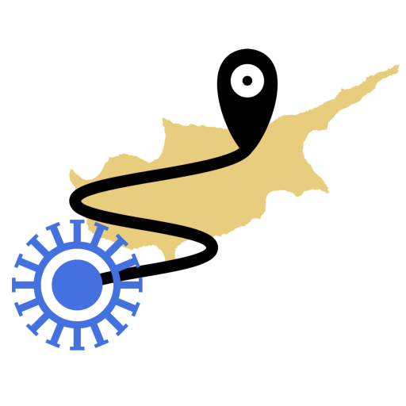
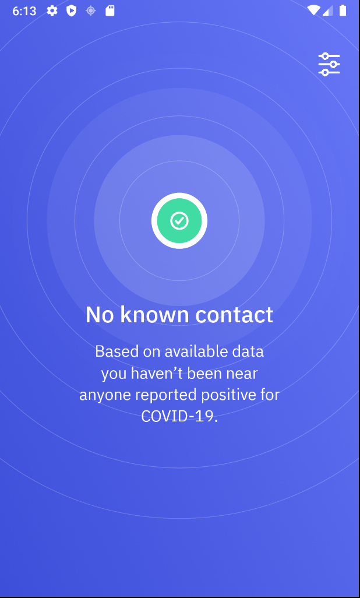

# COVID Safe Paths  

**Applying the technology and philosophy of Private Kit to COVID**

Help us stop COVID-19.

We’re building the next generation of secure location logging to preserve privacy and #flattenthecurve

Location logs provide time-stamped records of where users have been, allowing them to share information with health officials accurately and quickly. This helps support contact tracing efforts to slow the spread of the virus.

What’s truly special about Safe Paths, though, is its privacy protection. Data never leaves a user's device without their password entry and explicit consent. The location log generated by Safe Paths cannot be accessed from outside the user’s device, meaning data transfer occurs only if the user chooses to share it with a researcher or health official.

----



Safe Paths is a ‘privacy-first’ app that allows you to log your GPS trails on your own phone. The information is stored locally and never shared with anyone (not even with us or MIT) until you explicitly decide to manually export the data. The location log generated by Safe Paths cannot be accessed from outside the user’s device. Location information can be imported and exported by the user and used in other projects and applications.

Safe Paths logs your device’s location once every five minutes and stores 28 days of data in under 100KB of space.

**Home page:** https://covidsafepaths.org and https://safepaths.mit.edu

**Private Kit WhitePaper:** [Apps Gone Rogue: Maintaining Personal Privacy in an Epidemic](https://drive.google.com/file/d/1nwOR4drE3YdkCkyy_HBd6giQPPhLEkRc/view?usp=sharing)

**Downloads for COVID Safe Paths:** _coming soon!_

**Downloads for Private Kit (technology beta):** [Google Play](https://play.google.com/store/apps/details?id=edu.mit.privatekit) | [Apple Store](https://apps.apple.com/us/app/private-kit-prototype/id1501903733)

# Development Overview

This is a React Native app version 61.5

## Architecture

Please refer to `docs/Private Kit Diagram.png` for a basic overview on the sequencing of generalized events and services that are used by Safe Paths.

## Developer Setup

Run the ```dev_setup.sh``` (Linux/MacOS) or ```dev_setup.bat``` (Windows) for needed tools.  It is assumed that Android Studio and/or xcode (on macOS) is set up and configured correctly to run applications in the simulator.  For Android Studio, the dev_setup script can help you, but you still may need to configure at least one android virtual device (avd) from within Android Studio first before you can run the app.

## Running

```yarn``` must be installed for this project, as it does a better job installing dependendies across platforms.  The dev_setup script above should have done that for you.

### Install modules to the correct locations

1. ```yarn install``` (always do this after a new clone or checkout)
2. ```yarn install:pod``` (additional step for macOS if you want to do an iOS build)

### Run the app in a simulator

To run in the Android simulator (Windows, Linux, macOS):
```
npx react-native run-android
```
or (on macOS only)
```
npx react-native run-ios
```

NOTE: In some cases, these procedures can lead to the error `Failed to load bundle - Could not connect to development server`. In these cases, kill all other react-native processes and try it again.

## Contributing

Read the [contribution guidelines](CONTRIBUTING.md).


