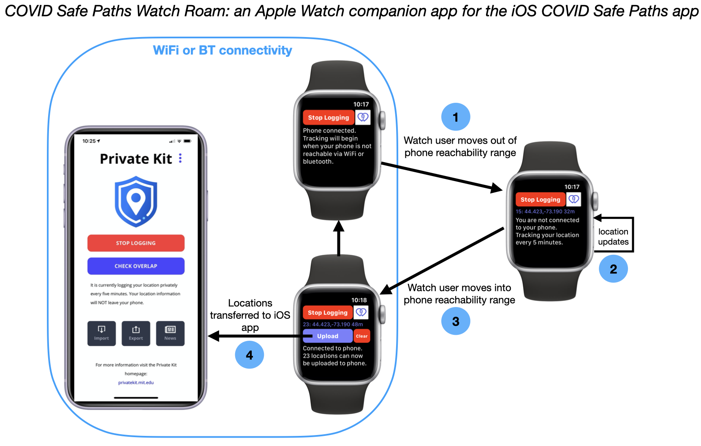

#  COVID Safe Paths Watch Roam

-------------------
### Overview

*COVID Safe Paths Watch Roam* is a WatchOS app that enables COVID SafePaths PrivateKit users to log their locations when they are out and about with their Apple Watches and no phone.  The impetus for this is based on the experience for some watch owners with GPS + cellular service, finding that they may take their phone with them less often.  With a watch, one's phone seems to become what one's laptop became when a first smartphone was acquired. 

### Integration with paired iOS app 

Communication with the paired iPhone relies on the Watch Connectivity Framework.  This framework abstracts out some details of phone->watch communication, such as whether the watch is connected to the phone via bluetooth or WiFi.

Location data flows only from the watch to the phone app.  The paired phone app implements a WCSessionDelegate (see Apple's [Watch Connectivity Framework](https://developer.apple.com/documentation/watchconnectivity/wcsessiondelegate)), with the data arriving via the callback:
`func session(WCSession, didReceiveMessage: [String : Any])`
in the AppDelegate.  Per the Watch Connectivity Framework conventions, each message arrives as a Swift Dictionary, where the key is `"location"` and the value is a string representation of the locations matching the JSON format used in the iOS app.  E.g. 3 locations appear as:
`[{"latitude":44.433276180915664,"longitude":-73.12025206383574,"time":1586280652163},
  {"latitude":44.4333901343521,"longitude":-73.12012488045465,"time":1586280665158},
  {"latitude":44.43336352230702,"longitude":-73.12010557309917,"time":1586280686181}]`
  in the callback.

The AppDelegate also implements: `func sessionDidDeactivate(_ session: WCSession) {session.activate()}`
to reconnect with the paired watch after it returns from a disconnnected state.

### UI/UX

When the watch finds itself away from its paired phone, the logging at 5' intervals begins automatically.  Upon returning to the phone after wandering, the Upload option appears.  If the user does nothing, and moves away from the phone again, the subsequent logging will be appended to the old logging.  This continues until the user uploads to the phone or clears the log.  In practice, watch users tend to return to within their phone's range daily.

This WatchOS app aims to use similar button color schemes as the main iOS app.  The status text area at the bottom helps to orient users as they move among the 3 states.  Logged coordinates and error radii are displayed for now, though that may not be ultimately necessary. 

### Application States

As shown in the diagram, the watch app has basically 3 states:
1. near phone with no locations logged
2. away from phone and logging locations
3. near phone with some locations saved from an outing

Logging can be disabled at any point.  Saved locations can simply be deleted (cleared) rather than transferring them to the COVID Safe Paths phone app.  Users' privacy and personal choices are the priority.

See the callback: `sessionReachabilityDidChange(_ session: WCSession)` in the file  `ExtensionDelegate.swift` for  implementation details.  This relies on the boolean function `WCSession.isReachable`  to determine state transitions.

### Battery Usage

Battery usage is an issue for phone apps, but is even more critical for watch apps.  The Core Location Framework provides various abstractions to accomodate the diverse needs of applications.  Given the 5' update interval, it would appear that periodic calls to `CLLocationManager.requestLocation()` would be appropropriate.  This will not work in the background, however, unless we use an extended runtime session or a workout session.  Both of these approaches are problematic because:
1. extended runtime sessions are limited to an hour
2. workout sessions use far too much power to be practical in this context
So, we are left with `CLLocationManager.startUpdatingLocation()` that provides callbacks at intervals more frequent then we need, but spatial and temporal filtering are applied as appropriate.  Spatial filtering is done via:  `CLLocationManager.distanceFilter`, and is arbitrarily set to 12 meters for now, but is easily changed if this is not appropriate.

A key factor that relates to battery usage is location accuracy, as specified via `LocationManager.desiredAccuracy`.  We are currently using `kCLLocationAccuracyNearestTenMeters`.  If that is insufficient resolution, `kCLLocationAccuracyBest` would be the next step but may be too costly.  To use even less power, we could back down to `kCLLocationAccuracyHundredMeters`, but this is probably not appropriate here.  Yes, it's definitely a Goldilocks thing.

